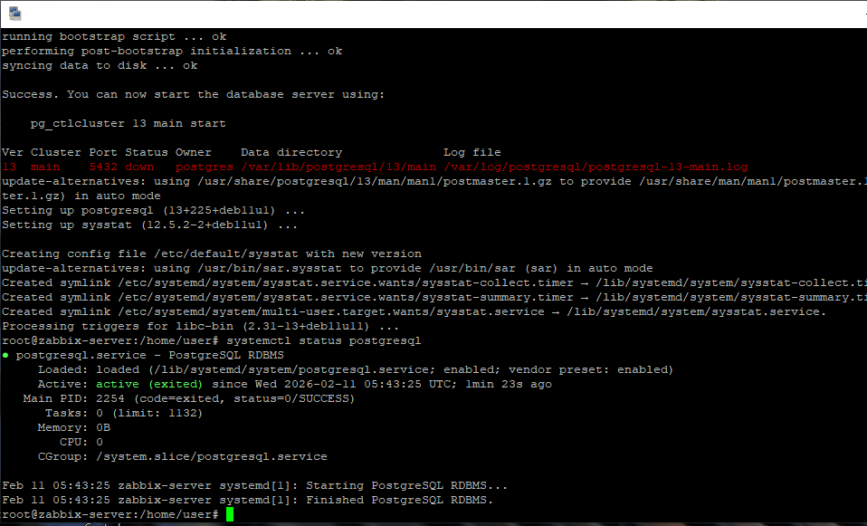
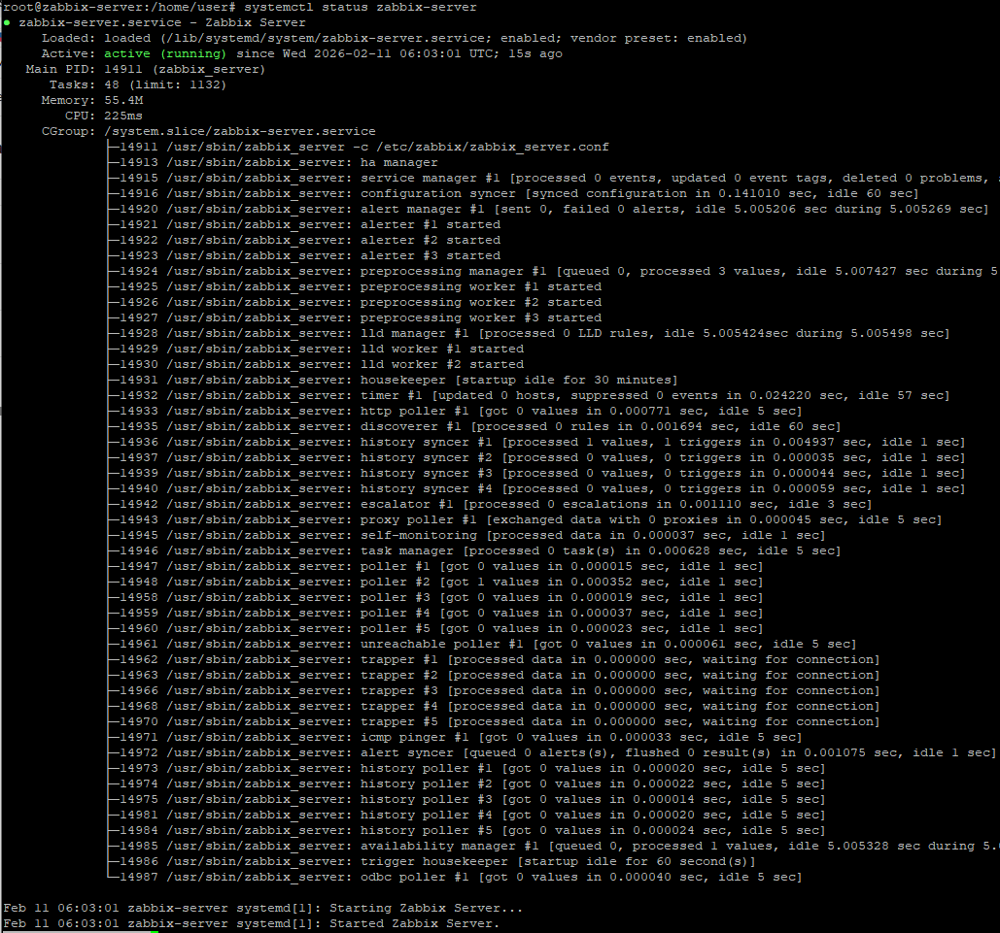
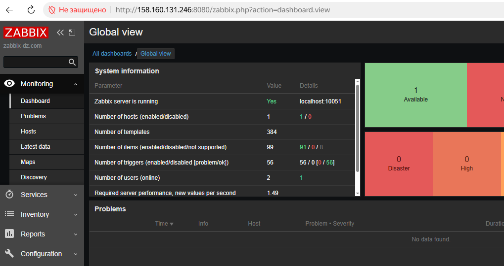
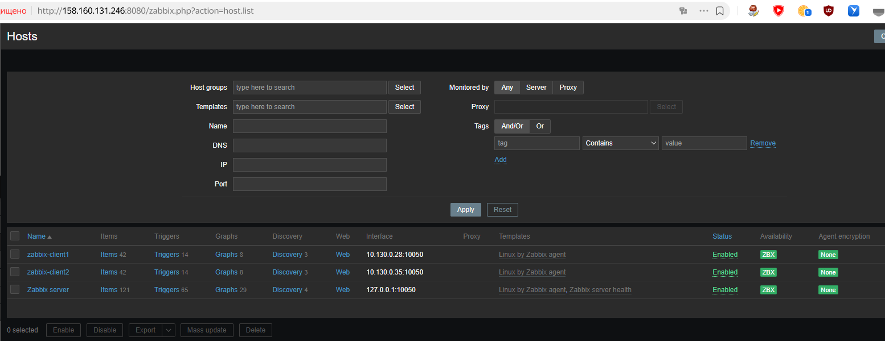
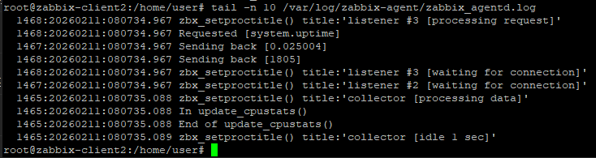
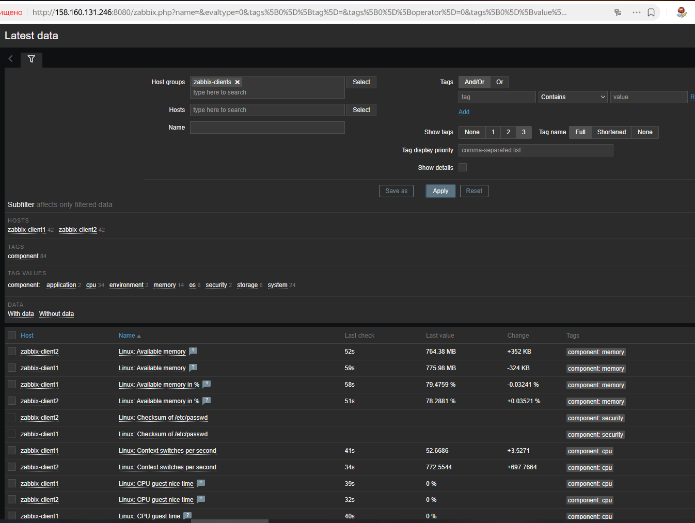

# Домашнее задание к занятию «Система мониторинга Zabbix Сафронов П.А.»

### Задание 1 

Установите Zabbix Server с веб-интерфейсом.

#### Процесс выполнения
1. Выполняя ДЗ, сверяйтесь с процессом отражённым в записи лекции.
2. Установите PostgreSQL. Для установки достаточна та версия, что есть в системном репозитороии Debian 11.
```
apt install postgresql
```


4. Пользуясь конфигуратором команд с официального сайта, составьте набор команд для установки последней версии Zabbix с поддержкой PostgreSQL и Nginx.

```
wget https://repo.zabbix.com/zabbix/6.0/debian/pool/main/z/zabbix-release/zabbix-release_latest_6.0+debian11_all.deb
dpkg -i zabbix-release_latest_6.0+debian11_all.deb
apt update
apt install zabbix-server-pgsql zabbix-frontend-php php7.4-pgsql zabbix-nginx-conf zabbix-sql-scripts zabbix-agent
sudo -u postgres createuser --pwprompt zabbix
sudo -u postgres createdb -O zabbix zabbix
zcat /usr/share/zabbix-sql-scripts/postgresql/server.sql.gz | sudo -u zabbix psql zabbix
```
Раскомментировать строку DBPassword и указать пароль от БД в файле /etc/zabbix/zabbix_server.conf
Отредактировать файл /etc/zabbix/nginx.conf раскомментировать и настроить директивы 'listen' и 'server_name'.
```
listen 8080;
server_name zabbix-dz.com;
```
Запустить процессы Zabbix сервера и агента и настроить их запуск при загрузке ОС.
```
systemctl restart zabbix-server zabbix-agent nginx php7.4-fpm
systemctl enable zabbix-server zabbix-agent nginx php7.4-fpm
```



5. Выполните все необходимые команды для установки Zabbix Server и Zabbix Web Server.



#### Требования к результатам 
1. Прикрепите в файл README.md скриншот авторизации в админке.
2. Приложите в файл README.md текст использованных команд в GitHub.

---

### Задание 2 

Установите Zabbix Agent на два хоста.

#### Процесс выполнения
1. Выполняя ДЗ, сверяйтесь с процессом отражённым в записи лекции.
2. Установите Zabbix Agent на 2 вирт.машины, одной из них может быть ваш Zabbix Server.
3. Добавьте Zabbix Server в список разрешенных серверов ваших Zabbix Agentов.
4. Добавьте Zabbix Agentов в раздел Configuration > Hosts вашего Zabbix Servera.
5. Проверьте, что в разделе Latest Data начали появляться данные с добавленных агентов.

#### Требования к результатам
1. Приложите в файл README.md скриншот раздела Configuration > Hosts, где видно, что агенты подключены к серверу

3. Приложите в файл README.md скриншот лога zabbix agent, где видно, что он работает с сервером

5. Приложите в файл README.md скриншот раздела Monitoring > Latest data для обоих хостов, где видны поступающие от агентов данные.

6. Приложите в файл README.md текст использованных команд в GitHub

---
## Задание 3 со звёздочкой*
Установите Zabbix Agent на Windows (компьютер) и подключите его к серверу Zabbix.

#### Требования к результатам
1. Приложите в файл README.md скриншот раздела Latest Data, где видно свободное место на диске C:
--- 

## Критерии оценки

1. Выполнено минимум 2 обязательных задания
2. Прикреплены требуемые скриншоты и тексты 
3. Задание оформлено в шаблоне с решением и опубликовано на GitHub


